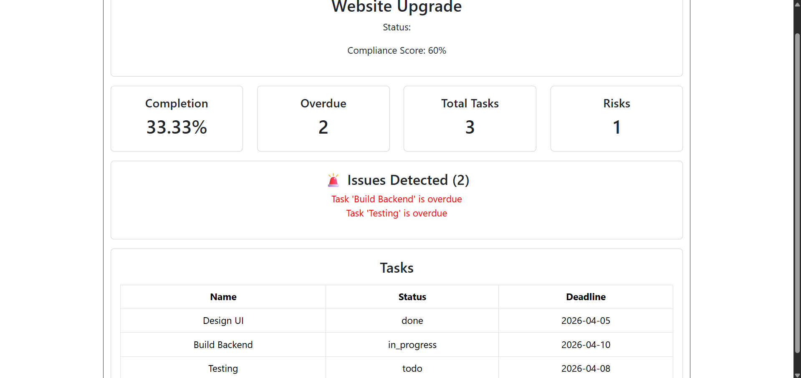

# 📊 PMO Automation Dashboard

A full-stack **Project Management Office (PMO) automation system** designed to simulate real-world project governance, reporting, and audit workflows. This application demonstrates how technology can streamline project tracking, compliance monitoring, and decision-making—aligned with enterprise environments like **Digicel Group Technology PMO**.

---

## 🚀 Overview

This system provides a **multi-project dashboard** where users can:

* View all projects in a centralized interface
* Click into individual projects to see detailed dashboards
* Monitor project health, risks, and compliance
* Automatically detect governance issues through an audit engine

---

## 📸 Screenshots

### 🗺️ View Project Page


---

## 🧱 Tech Stack

### 🔹 Backend

* Python (Flask)
* Flask-SQLAlchemy (ORM)
* PostgreSQL
* Flask-CORS

### 🔹 Frontend

* React (Vite)
* React Router
* Bootstrap (UI styling)

---

## 🎯 Key Features

### ✅ Multi-Project Dashboard

* Displays all projects in a grid layout
* Each project shows:

  * Status (Healthy / At Risk / Critical)
  * Completion %
  * Task metrics

### ✅ Project-Level Dashboard

* Detailed view per project
* Includes:

  * Project status
  * Task metrics
  * Risk indicators
  * Compliance score

### ✅ Audit Engine (Core Feature)

Automatically analyzes project data and detects issues such as:

* Overdue tasks
* Missing deadlines
* Lack of progress

Outputs:

* Compliance score (%)
* Issue count
* Actionable issue list

### ✅ Tasks Management View

* Displays all project tasks
* Status-based highlighting
* Deadline tracking

### ✅ API-Driven Architecture

* RESTful Flask API
* React frontend consumes endpoints dynamically

---

## 📂 Project Structure

```
backend/
 ├── app.py
 ├── models/
 ├── routes/
 ├── services/
 └── seed_db.py

frontend (pmo-app)/
 ├── src/
 │    ├── components/
 │    ├── pages/
 │    ├── services/
 │    └── App.jsx
```

---

## 🔌 API Endpoints

### Get All Projects

```
GET /projects
```

### Get Full Project Report

```
GET /full-report/<project_id>
```

Returns:

* Project info
* Metrics (completion, overdue tasks, etc.)
* Audit results
* Task list

---

## ⚙️ Installation & Setup

### 🔹 Backend

```bash
# Create virtual environment
python -m venv venv

# Activate (Windows)
venv\Scripts\activate

# Install dependencies
pip install -r requirements.txt

# Run server
python app.py
```

---

### 🔹 Frontend

```bash
cd pmo-app

# Install dependencies
npm install

# Install Bootstrap
npm install bootstrap

# Run app
npm run dev
```

---

## 🌐 Access

* Frontend: http://localhost:5173
* Backend API: http://127.0.0.1:5000

---

## 🧠 Design Philosophy

This project is built to reflect **real PMO operations**, focusing on:

* **Automation over manual reporting**
* **Data-driven decision making**
* **Scalable architecture**
* **Separation of concerns (frontend vs backend)**

---

## 💼 Use Case (Real-World Relevance)

In large organizations like Digicel, PMOs manage multiple concurrent projects. This system demonstrates how:

* Project tracking can be automated
* Risks can be surfaced early
* Reporting can be standardized
* Decision-makers can act faster

---

## 🚀 Future Improvements

* 📊 Data visualization (charts using Recharts or Power BI)
* 🔍 Project filtering and search
* ☁️ Deployment (Docker + Cloud)

---

## 🏁 Summary

This project showcases:

* Full-stack development (Flask + React)
* API design and integration
* Process automation in a PMO context
* Practical application of software engineering to business problems

---
